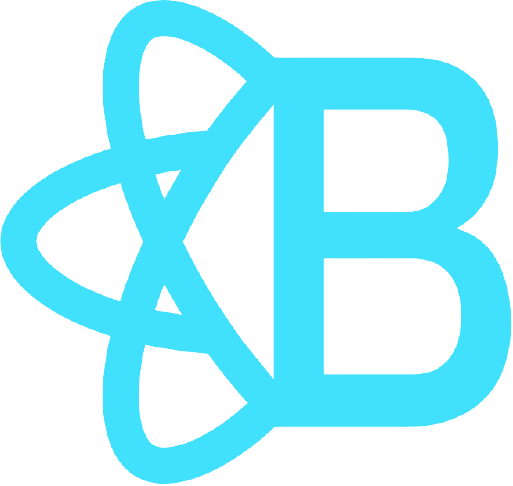
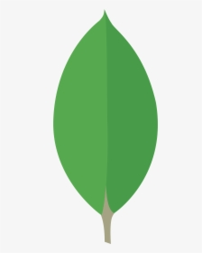

# Crytonite

Crytonite is a cryptocurrency application utilizing the MERN stack and blockchain technology written in JavaScript. React is powering the front end views with Express routing our backend to mongoDB. There are also several npm packages we employed to deliver the features of our MVP. Below we'll discuss certain features and why we made the decisions we did in our applications.

Go to [Crytonite.](https://cryptonite.azurewebsites.net/)


<hr>

## Table of Contents

1. Technology & third-party APIs
2. Installation
3. Our Blockchain Requirements & Features
4. Usage & Features
5. Contributing & Future Development
6. Contact Us

<hr>


## Technology & third-party APIs

 &nbsp;
 &nbsp;
 &nbsp;
 &nbsp;
 &nbsp;
 &nbsp;
 &nbsp;
 &nbsp;
 &nbsp;
 &nbsp;
 &nbsp;
 &nbsp;
 &nbsp;
 &nbsp;
 &nbsp;

These are all the technologies we used to build our application:

- HTML
- CSS
- JavaScript
- [Bootstrap](https://getbootstrap.com/)
- [React](https://reactjs.org/)
- [React-Bootstrap](https://react-bootstrap.github.io/)
- [mongoDB](https://www.mongodb.com/)
- [Mongoose](https://mongoosejs.com/)
- [Stripe](https://stripe.com/)
- [Node.js](https://nodejs.org/en/)
- npm packages
  - [express](https://www.npmjs.com/package/express)
  - [express-session](https://www.npmjs.com/package/express-session)
  - [bcrypt](https://www.npmjs.com/package/bcrypt)
  - [axios](https://www.npmjs.com/package/axios)
  - [dotenv](https://www.npmjs.com/package/dotenv)
  - [sidenavjs](https://www.npmjs.com/package/sidenavjs)
  - [chartjs](https://www.chartjs.org/)
  - [elliptic](https://www.npmjs.com/package/elliptic)
  - [crypto-js](https://www.npmjs.com/package/crypto-js)
  - 
- [fontawesome](https://fontawesome.com/)
- [Google Identity](https://developers.google.com/identity/sign-in/web/sign-in)
- [Google Fonts](https://fonts.google.com/)

Please visit the links above to learn more and read their documentation.

## Installation

The following are requirements for installation:

- mongoDB Atlas account
- Stripe account
- MongoDBShell
- Robo 3T

Please fork this repository to get started.

Once forked please open your git terminal and run the following command in the root directory.
```
npm install
```

The following dependencies will be installed:

<-------------picture of dependencies here for server and client (package.json)


## Our Blockchain Requirements & Features


## Usage & Features

<-------- Gif of signing and signing in with Google and public key/copy feature

<-------- Gif of Profile page and viewing wallet amount, transaction history and sorting/pagination

<-------- Gif of buying coins and success/failure messages

<-------- GIf of sending coins and success/failure messages

<-------- Gif of mining coins and success/failure messages

<-------- Gif of deleting account and success/failure messages


## Contributing & Future Development


## Contact Us

Please feel free to reach out to us with questions we'd be happy to chat. If you'd like to reach us individually or see some of our other works please follow the links below.

<br>
  - Dylan Couzon
    - [dylancouzon@gmail.com](mailto:dylancouzon@gmail.com)
    - [GitHub](https://github.com/Dylancouzon)
    - [LinkedIn](https://www.linkedin.com/in/dcouzon/)
<br>
  - Jake Novelli
    - [jakenovelli11@gmail.com](mailto:jakenovelli11@gmail.com)
    - [GitHub](https://github.com/dnovelli1)
    - [LinkedIn](https://www.linkedin.com/in/david-jacob-novelli/)
<br>
  - Liam Stewart
    - [liamchristopher.media@gmail.com](mailto:liamchristopher.media@gmail.com)
    - [GitHub](https://github.com/LiamStewart8/gamehub)
    - [LinkedIn](https://www.linkedin.com/in/liamsctewart/)
<br>
  - Cheng Tang
    - [cheng21tang@gmail.com](mailto:cheng21tang@gmail.com)
    - [GitHub](https://github.com/cheng21tang)
    - [LinkedIn](https://www.linkedin.com/in/cheng21tang/)
