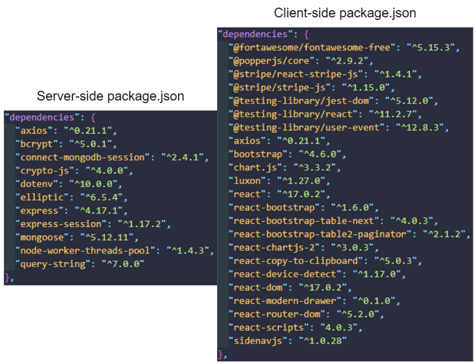
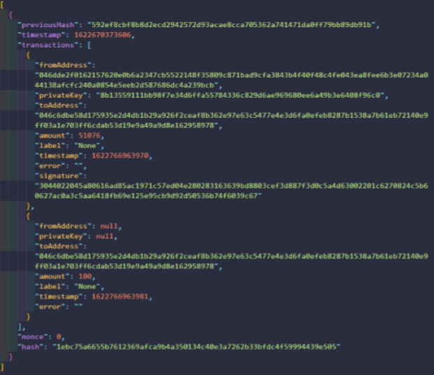
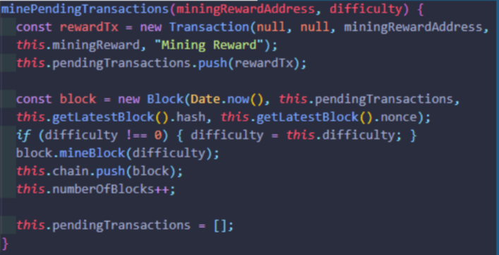
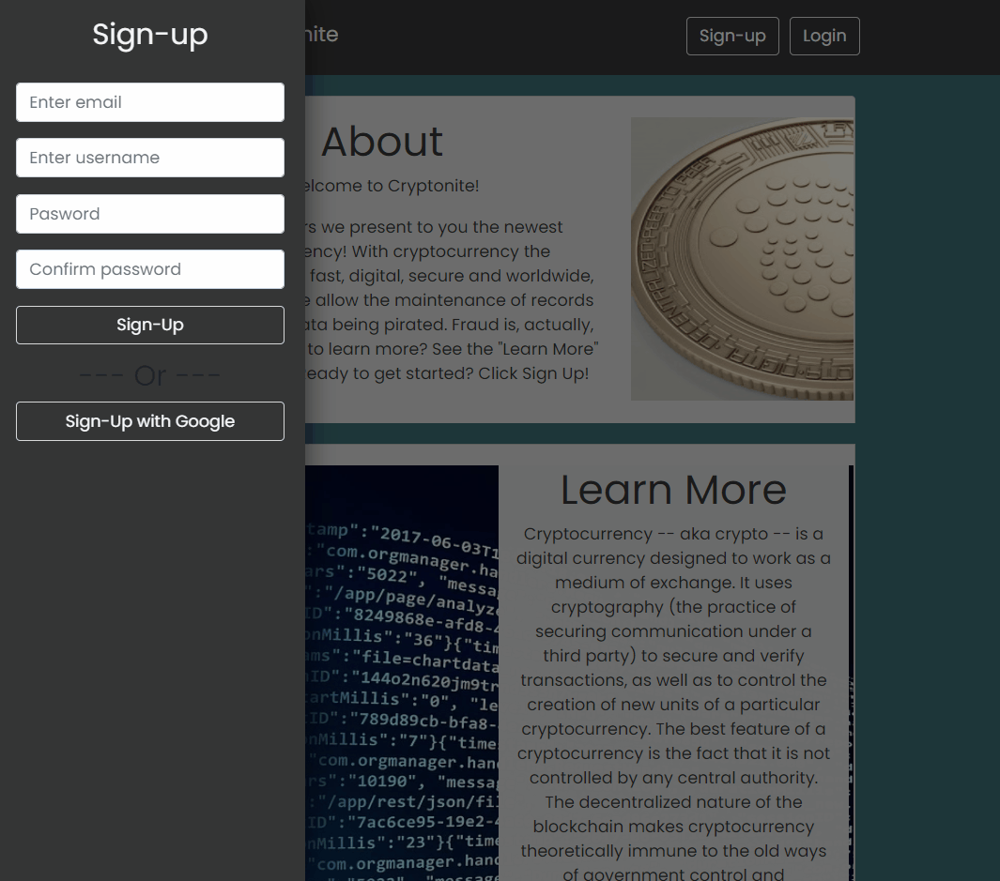
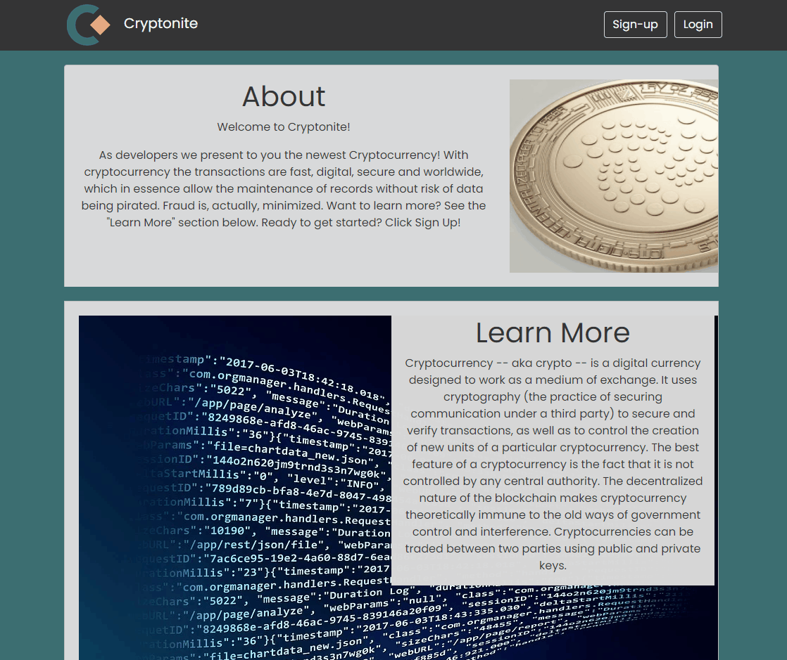
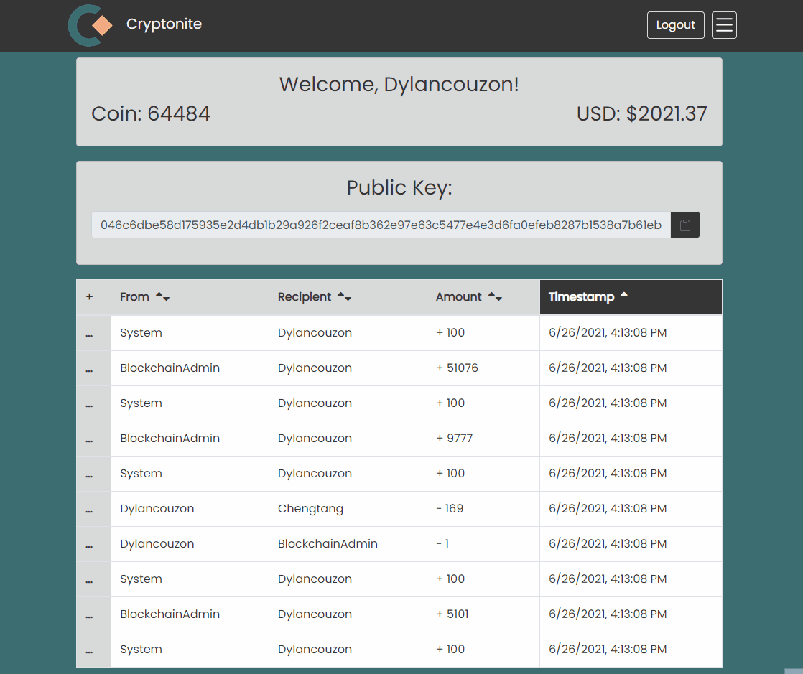
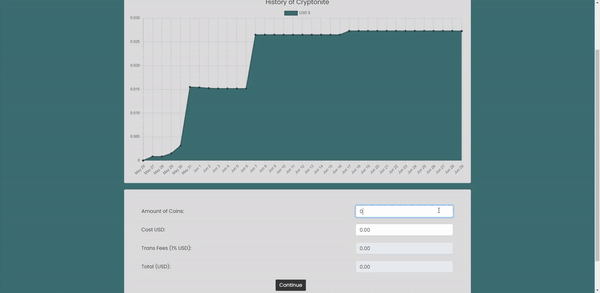
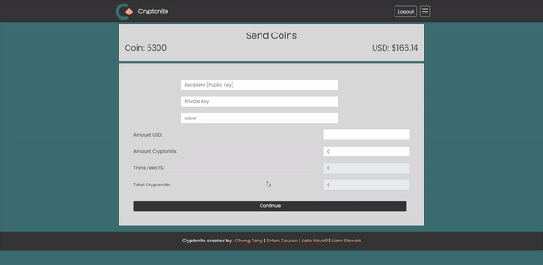
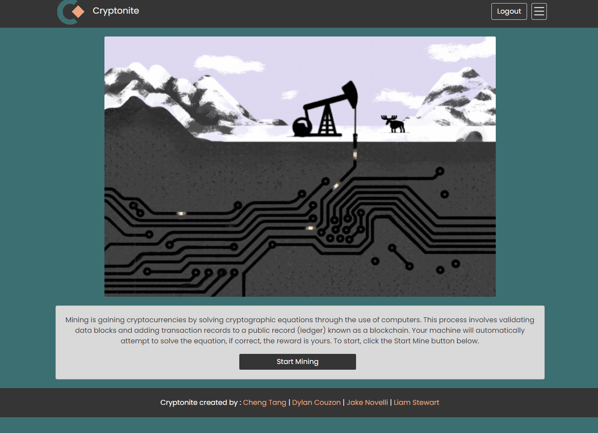
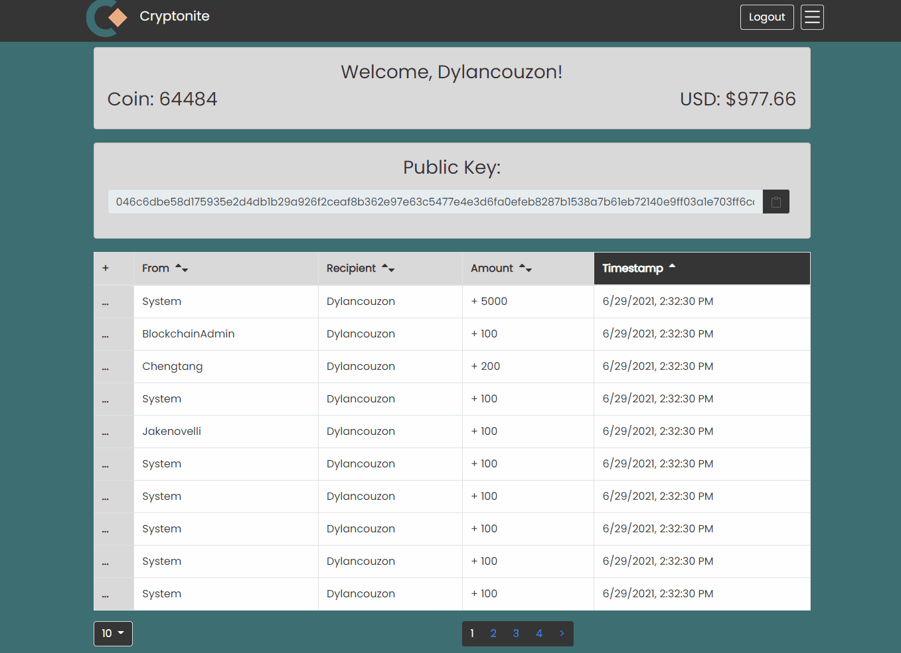

# Cryptonite

Cryptonite is a cryptocurrency application utilizing the MERN stack and blockchain technology written in JavaScript. React is powering the front end views with Express routing our backend to mongoDB. There are also several npm packages we employed to deliver the features of our MVP. Below we'll discuss certain features and why we made the decisions we did in our application.

Go to [Crytonite.](https://cryptonite.azurewebsites.net/)


<hr>

## Table of Contents

1. Technology & third-party APIs
2. Installation
3. Our Blockchain Requirements & Features
4. Usage & Features
5. Contributing & Future Development
6. Contact Us

<hr>


## Technology & third-party APIs

 &nbsp;
 &nbsp;
 &nbsp;
 &nbsp;
 &nbsp;
 &nbsp;
 &nbsp;
 &nbsp;
 &nbsp;
 &nbsp;
 &nbsp;
 &nbsp;
 &nbsp;
 &nbsp;
 &nbsp;

These are all the technologies we used to build our application:

- HTML
- CSS
- JavaScript
- [Bootstrap](https://getbootstrap.com/)
- [React](https://reactjs.org/)
- [React-Bootstrap](https://react-bootstrap.github.io/)
- [mongoDB](https://www.mongodb.com/)
- [Mongoose](https://mongoosejs.com/)
- [Stripe](https://stripe.com/)
- [Node.js](https://nodejs.org/en/)
- npm packages
  - [express](https://www.npmjs.com/package/express)
  - [express-session](https://www.npmjs.com/package/express-session)
  - [bcrypt](https://www.npmjs.com/package/bcrypt)
  - [axios](https://www.npmjs.com/package/axios)
  - [dotenv](https://www.npmjs.com/package/dotenv)
  - [sidenavjs](https://www.npmjs.com/package/sidenavjs)
  - [chartjs](https://www.chartjs.org/)
  - [elliptic](https://www.npmjs.com/package/elliptic)
  - [crypto-js](https://www.npmjs.com/package/crypto-js)
  - 
- [fontawesome](https://fontawesome.com/)
- [Google Identity](https://developers.google.com/identity/sign-in/web/sign-in)
- [Google Fonts](https://fonts.google.com/)

Please visit the links above to learn more and read their documentation.

## Installation

Please fork this repository to get started. The following are requirements for installation:

- mongoDB Atlas account
- Stripe account
- MongoDBShell
- Robo 3T
- .env
- Stripe Publishable and Secret keys (please refer to Stripe's documentation to learn more)

Once forked please open your git terminal and run the following command in the root directory.
```
npm install
```

The following dependencies will be installed:




**.env**
You will also need to setup your .env file with the following variables:
```
SECRET = { your own variables here}
PORT = 
MONGODB_URI =
NODE_ENV =
STRIPE_TEST_SECRET_KEY =
```

<br>


## Deployment

To deploy the react app, please run the following command:
```
npm run build
```
Then, to run the backend server, run the following command:
```
npm start
```

The App should be accessible on the link: http://localhost:5001

<br>

## Our Blockchain Requirements & Features

The blockchain Data structure is a reversed linked list. Each block references the previous block via its hash, all the way down to the genesis block.
Each block contains a timestamp of its creation, a list of transactions, the hash of the previous block, the hash of this block, a nonce, and a Merkle root.
The Merkle root encodes the data from all the previous blocks (Like a Binary search tree) to allow us to verify the integrity of the chain.



Our blockchain works on a centralized ledger, which means that several copies of the blockchain are saved on a central server.
Each miner that attempts to mine a block, is requested to solve a mathematical problem on a random copy of the blockchain
The first person to achieve it will then send the results to the other miners to be verified.
If a consensus is reached, the block is mined and each copy is updated.




## Usage & Features

**Sign-up, user validation, and Private Key modal**

A side navigation menu slides over when a user goes to sign-up. Here they will enter their email address, username, and password twice to confirm. With server-side validation for each field we will present feedback to the user with alet banners if a field is inputted incorrectly. Then an alert modal will call attention to the user's Private Key and they will not be able to close the modal unless they copy-to-clipboard their private key.



**Sign-up/Login with Google**
We also provide user's the ability to sign-in with Google by connected to Google's API.



**Profile, Wallet, and Transactions**
After a user has signed-up



**Buying coins**

One of the first steps a user might get started in our application is by purchasing coins. Here the user can input the number of Cryptonite coins they would like to purchase or specify a USD amount. Both fields with dynamically be generate off of one another. Then using Stripe's payment processing API, we present this to the user with a Payment Information modal where they can enter their payment details. We then handle error/success messages calling attention to them using modals.



<-------- GIf of sending coins and success/failure messages
**Sending coins**

When sending coins, the user will need to have their Private Key and the recipients Public Key. Here they can write a message for why their sending coins and either enter the amount of coins to send or the amount USD amount. There is logic in each field to calculate the other based on the current price of Crytonite.
<!--  -->




As part of our blockchain's requirements, we needed to have the ability to validate transactions before being appended to the blockchain. We accomplished this by having a mining method that a user would call upon within our application. Under the hood, the mining method is looking for hash starting with "00000". (See more above). If a user has successfully or failed to mine a block, we will then alert the user with the corresponding modals.





## Contributing & Future Development


## Contact Us

Please feel free to reach out to us with questions we'd be happy to chat. If you'd like to reach us individually or see some of our other works please follow the links below.


  - Dylan Couzon
    - <a href="mailto:dylancouzon@gmail.com" target="_blank">Email</a>
    - <a href= "https://github.com/Dylancouzon" target="_blank">Github</a>
    - <a href= "https://www.linkedin.com/in/dcouzon/">LinkedIn</a>
    
  - Jake Novelli
    - <a href="mailto:jakenovelli11@gmail.com" target="_blank">Email</a>
    - <a href= "https://github.com/dnovelli1" target="_blank">Github</a>
    - <a href= "https://www.linkedin.com/in/david-jacob-novelli/">LinkedIn</a>

  - Liam Stewart
    - <a href="mailto:liamstewartdev@gmail.com" target="_blank">Email</a>
    - <a href= "https://github.com/LiamStewartDev" target="_blank">Github</a>
    - <a href= "https://www.linkedin.com/in/liamsctewart/">LinkedIn</a>

  - Cheng Tang
    - <a href="mailto:cheng21tang@gmail.com" target="_blank">Email</a>
    - <a href= "https://github.com/cheng21tang" target="_blank">Github</a>
    - <a href= "https://www.linkedin.com/in/cheng21tang/">LinkedIn</a>

